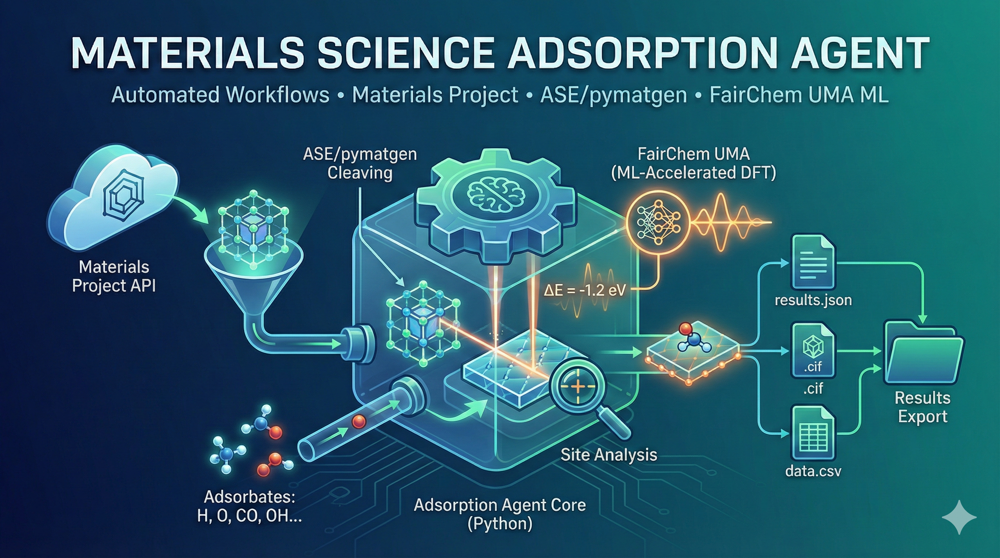

# Materials Science Adsorption Agent

A Python agent for automated materials science workflows, focusing on surface adsorption analysis using Materials Project data, ASE/pymatgen tools, and FairChem UMA machine learning potentials.

## Features

1. **Materials Project Integration**: Retrieve crystal structures using MP API
2. **Structure Conversion**: Convert pymatgen structures to ASE Atoms objects
3. **Surface Cleaving**: Generate surface slabs with user-specified Miller indices and terminations
4. **Adsorbate Selection**: Choose from common adsorbates (H, O, CO, OH, N, etc.)
5. **Adsorption Site Analysis**: Find optimal adsorption sites using pymatgen algorithms
6. **ML-Accelerated DFT**: Calculate adsorption energies using FairChem UMA models
7. **Results Export**: Generate CIF files and comprehensive JSON reports

## Installation

Requires **Python 3.11–3.13** (driven by fairchem-core 2.x).

```bash
# Create virtual environment
python -m venv venv
source venv/bin/activate  # Linux/Mac
# or: venv\Scripts\activate  # Windows

# Install the package (geometry workflow: slabs + adsorption sites)
pip install .

# Optional: ML adsorption energies (installs torch ~=2.8, large download)
pip install ".[ml]"

# Optional: AdsorbML production workflows
pip install ".[adsorbml]"

# Set up Materials Project API key
export MP_API_KEY="your_api_key_here"
# Or create a .env file with: MP_API_KEY=your_api_key_here
```

UMA checkpoints are gated on Hugging Face: request access to
[facebook/UMA](https://huggingface.co/facebook/UMA) and run
`huggingface-cli login` once.

## Quick Start

### Command Line Interface

```bash
# Basic usage - analyze silicon (111) surface with H adsorbate
python -m agent_materials_science.cli --material Si --miller 1,1,1 --adsorbate H

# Using Materials Project ID
python -m agent_materials_science.cli --mp-id mp-149 --miller 1,1,0 --adsorbate CO

# Full workflow with relaxed energy calculations
agent-materials-science \
    --material SrTiO3 \
    --miller 1,0,0 \
    --adsorbate O \
    --layers 6 \
    --vacuum 15 \
    --supercell 2,2 \
    --calculate-energies \
    --relax --fix-layers 2 \
    --device auto \
    --output-dir outputs/srtio3_analysis
```

The `agent-materials-science` console script is installed with the package;
`python -m agent_materials_science.cli` works too.

### Python API

```python
from agent_materials_science import MaterialsScienceAgent, AgentConfig

# Create agent configuration
config = AgentConfig(
    material="Si",
    miller_indices=(1, 1, 1),
    adsorbate="H",
    n_layers=6,
    vacuum=15.0,
    supercell=(2, 2),
    calculate_energies=True,
    output_dir="outputs"
)

# Run agent
agent = MaterialsScienceAgent(config)
result = agent.run()

# Access results
print(f"Material: {result.formula} ({result.material_id})")
print(f"Best adsorption site: {result.best_site}")
print(f"Output files: {result.output_files}")
```

## Configuration

### Environment Variables

| Variable | Description | Default |
|----------|-------------|---------|
| `MP_API_KEY` | Materials Project API key | Required |
| `FAIRCHEM_MODEL` | FairChem model name | `uma-s-1p2` |
| `FAIRCHEM_TASK` | UMA task head (`oc20`, `omat`, `omol`, …) | `oc20` |
| `FAIRCHEM_DEVICE` | Device: `auto`, `cpu`, `cuda` | `auto` |

Explicit constructor/CLI arguments always take precedence over environment
variables.

### Supported Adsorbates

27 species, including atoms (H, O, N, C, S, F, Cl), diatomics (H2, O2, N2,
CO/OC, OH/HO, NO/ON, HF, HCl) and molecules (H2O, CO2, N2O, NH3, CH4, C2H2,
C2H4, HCOO, CH3OH). Run `agent-materials-science --list-adsorbates` for the
authoritative list with descriptions.

### FairChem Models

UMA models require **FairChem v2** and a Hugging Face account with access
granted to the UMA model repository (`huggingface-cli login`).

- `uma-s-1p2` - UMA small v1.2 (latest small model; recommended, default)
- `uma-s-1p1` - UMA small v1.1
- `uma-m-1p1` - UMA medium v1.1 (higher accuracy, slower)
- `esen-*` - eSEN models

> `uma-s-1` was **removed** from the FairChem registry and can no longer be
> downloaded. Run `agent-materials-science --list-models` to query the live
> registry when fairchem-core is installed. A local checkpoint file path can
> be passed via `--model /path/to/checkpoint.pt`.

Pick the **task head** to match the problem: `oc20` for surface adsorption /
catalysis (the default here), `omat` for bulk inorganic materials, `omol` for
isolated molecules. Mixing task heads between the slab and the reference makes
adsorption energies meaningless.

### Adsorption-site backend

Site finding uses **pymatgen's `AdsorbateSiteFinder`** when pymatgen is
installed (`--site-finder auto`, the default). It is symmetry-aware, so it
returns only the distinct sites and avoids redundant energy evaluations. A
self-contained, periodicity-correct geometric finder is used as a fallback
(`--site-finder builtin`). Pass `--no-symm-reduce` to keep every site.

## Project Structure

```
agent_materials_science/
├── __init__.py           # Package exports
├── agent.py              # Main agent orchestration
├── cli.py                # Command line interface
├── config.py             # Configuration management
├── core/
│   ├── __init__.py
│   ├── adsorption.py     # Adsorption site finding
│   ├── surface.py        # Surface/slab generation
│   └── workflow.py       # Workflow orchestration
├── tools/
│   ├── __init__.py
│   ├── materials_project.py  # MP API wrapper
│   ├── ase_tools.py      # ASE utilities
│   ├── fairchem_calc.py  # FairChem calculator
│   └── converters.py     # Structure converters
├── outputs/              # Default output directory
├── requirements.txt
└── README.md
```

## Output Files

The agent generates the following output files:

- `{material_id}_slab_{hkl}.cif` - Clean slab structure
- `{material_id}_slab_{hkl}.vasp` - VASP POSCAR format
- `{material_id}_sites.json` - Adsorption sites data
- `{material_id}_best_site.cif` - Structure with adsorbate at best site
- `{material_id}_results.json` - Complete analysis results

## Methodology notes & limitations

- **Adsorption-energy convention.** `E_ads = E(slab+ads) − E(slab) −
  E_gas(ads)`, where `E_gas` follows the **OC20 convention**: a linear
  combination of per-element reference energies (H −3.477, C −7.282,
  O −7.204, N −8.083 eV, from the OC20 paper) that pairs consistently with
  UMA `oc20` total energies — this is the scheme recommended by the FairChem
  documentation. Adsorbates containing other elements fall back to relative
  energies (site ranking is still valid) unless you provide per-element
  overrides via `get_adsorbate_reference_energy(..., overrides=...)`.
- **Consistent relaxation.** With `--relax`, the clean slab is relaxed once
  (before site finding) and each slab+adsorbate system is relaxed, so both
  totals in `E_ads` come from relaxed geometries. Use `--fix-layers 2` (or
  more) to hold the bottom layers bulk-like during relaxations.
- **ML accuracy.** Energies come from a machine-learned potential (UMA);
  expect ~0.1 eV-scale deviations from explicit DFT depending on the system.
- **Single initial placement per site.** Each site is evaluated from one
  initial geometry (optionally relaxed). The state-of-the-art recipe is
  [AdsorbML](https://www.nature.com/articles/s41524-023-01121-5): generate many
  initial configurations, ML-relax each, and take the minimum — available via
  `pip install "fairchem-core[adsorbml]"` (or higher-level libraries such as
  [`quacc`](https://quacc.readthedocs.io) `slab_to_ads_flow` and `atomate2`)
  for production studies.
- **Surface-normal assumption.** Site finding assumes the surface lies in the
  xy-plane with vacuum along z (the convention produced by the slab builder).

## License

MIT License
